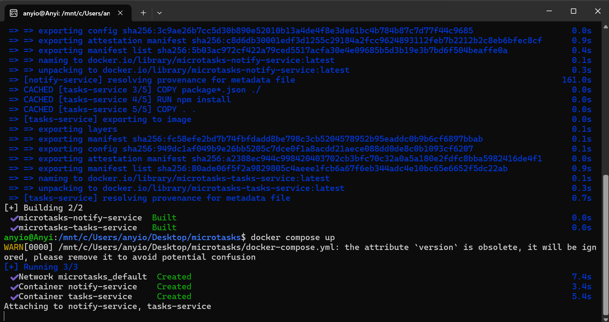
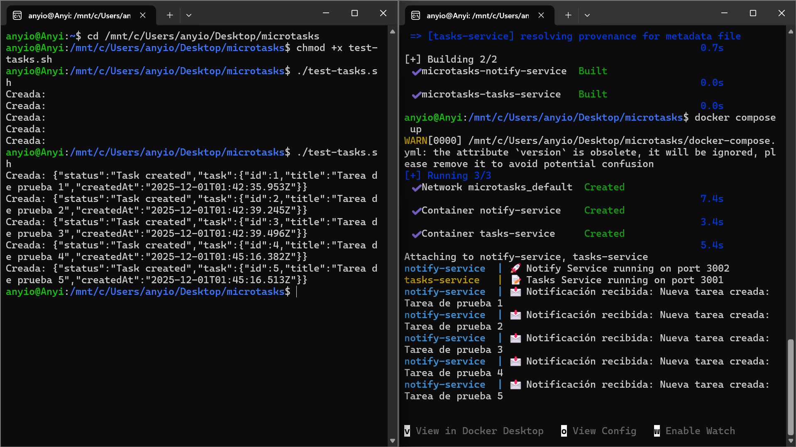
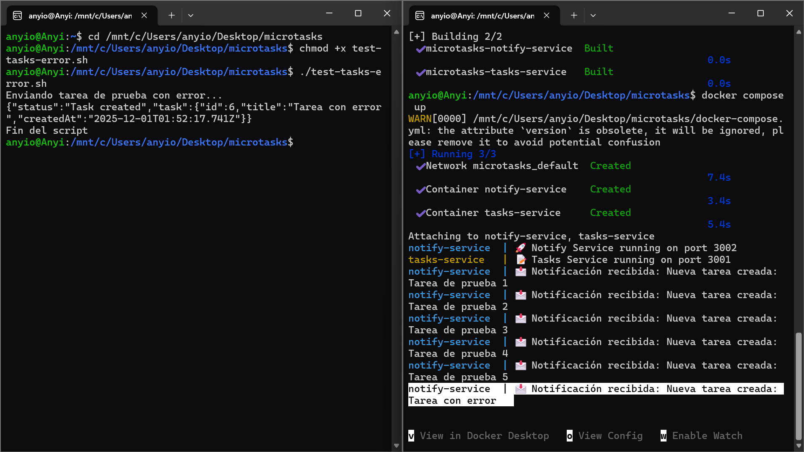
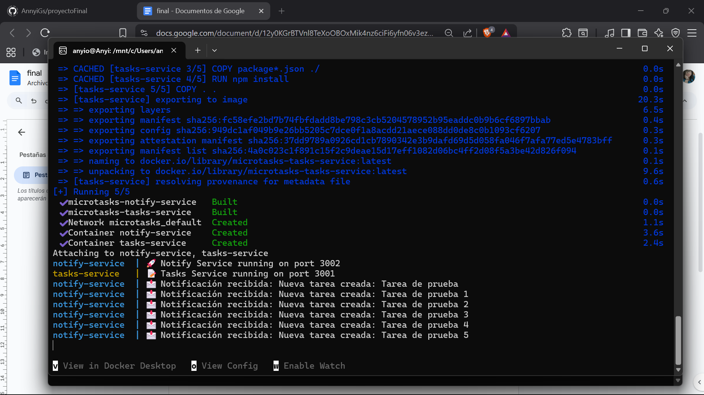

# MicroTasks - Proyecto

## 🎯 Objetivo del Proyecto
MicroTasks es un proyecto educativo diseñado para demostrar y practicar la implementación completa de una arquitectura de microservicios. El objetivo principal es servir como herramienta de aprendizaje para desarrolladores que desean comprender conceptos de microservicios, contenerización, orquestación y DevOps en un entorno controlado.

## 📋 Descripción del Sistema
MicroTasks implementa una aplicación de gestión de tareas con notificaciones automáticas, compuesta por dos microservicios independientes:

### 🏗️ Arquitectura
Cliente → [tasks-service] → [notify-service]
     ↓              ↓
   API REST      Notificación HTTP

### 🔧 Componentes Principales

#### 1. Tasks-Service
- Puerto: 3000
- Responsabilidad: Gestión completa de tareas (CRUD)
- Funcionalidades:
  - Crear nuevas tareas (POST /tasks)
  - Listar todas las tareas (GET /tasks)
  - Notificación automática al notify-service
  - Exposición de métricas en /metrics

#### 2. Notify-Service
- Puerto: 4001
- Responsabilidad: Procesamiento de notificaciones
- Funcionalidades:
  - Recepción de notificaciones (POST /notify)
  - Almacenamiento de logs
  - Exposición de métricas en /metrics

## ⚙️ Tecnologías Implementadas

### Backend y Runtime
- Node.js: Entorno de ejecución para ambos microservicios
- Express.js: Framework web para APIs REST
- Axios: Cliente HTTP para comunicación entre servicios

### Contenerización y Orquestación
- Docker: Contenerización de aplicaciones
- Docker Compose: Orquestación local multi-contenedor
- Kubernetes: Orquestación de producción (en progreso)

### Comunicación
- REST API: Comunicación síncrona HTTP/JSON
- DNS interno: Resolución de nombres entre servicios

## 🚀 Funcionalidades Implementadas

### Core Features
- Creación de tareas con persistencia en memoria
- Listado de todas las tareas existentes
- Sistema de notificaciones automáticas
- Comunicación HTTP confiable entre servicios
- APIs REST documentadas y funcionales

### Características Técnicas
- Contenerización completa con Docker
- Orquestación local con Docker Compose
- Configuración de variables de entorno
- Logs estructurados y centralizados
- Manejo de errores y timeouts

## 📊 Flujo de Operación

1. Cliente envía solicitud → POST /tasks a tasks-service
2. Almacenamiento → tasks-service guarda la tarea en memoria
3. Notificación → tasks-service envía HTTP POST a notify-service
4. Procesamiento → notify-service recibe y registra la notificación
5. Respuesta → Cliente recibe confirmación de la operación

## 🛠️ Configuración y Despliegue

### Entorno local (sin Docker)
## Tasks Service
cd tasks-service
npm install
node index.js

## Notify Service
cd notify-service
npm install
node index.js

### Contenerización (Docker)
# Construir imágenes
docker build -t tasks-service ./tasks-service
docker build -t notify-service ./notify-service

# Levantar con Docker Compose (recomendado)
docker-compose up --build

### Kubernetes (En progreso)
# Despliegue en cluster
kubectl apply -f k8s/tasks-deployment.yaml
kubectl apply -f k8s/notify-deployment.yaml

## 📈 Progreso

### ✅ FASE 1 - COMPLETADA: Desarrollo Base
- Diseño de arquitectura de microservicios
- Implementación de tasks-service con CRUD completo
- Implementación de notify-service con receptor de notificaciones
- Comunicación HTTP funcional entre servicios
- Pruebas unitarias y de integración locales

### ✅ FASE 2 - COMPLETADA: Contenerización
- Dockerfiles optimizados para ambos servicios
- Imágenes Docker construidas y validadas
- Docker Compose configurado y probado
- Comunicación inter-contenedor verificada
- Pruebas end-to-end en entorno contenerizado

### 🚧 FASE 3 - EN PROGRESO: Kubernetes
- Manifiestos YAML generados para deployments
- Configuración de servicios y networking
- Preparación de entornos de namespaces
- Configuración para Kind cluster
- Diagnóstico de problemas de comunicación entre pods
- Ajuste de políticas de red y conectividad

### 📋 FASE 4 - PENDIENTE: Production Ready
- Configuración de monitorización con Prometheus
- Implementación de Grafana para dashboards
- Pipeline CI/CD con GitHub Actions
- Configuración de secrets y seguridad
- Pruebas de chaos engineering
- Documentación completa de operación

## 🎯 Estado Actual

El proyecto se encuentra en la transición entre Docker Compose y Kubernetes. Los microservicios funcionan correctamente en entornos locales y contenerizados con Docker Compose, pero enfrentamos desafíos en la configuración de Kubernetes para lograr la misma funcionalidad en el entorno orchestrated.

## 🔄 Próximos Pasos

1. Resolver problemas de conectividad en Kubernetes
2. Implementar configuración de servicios y DNS interno
3. Configurar monitorización y métricas
4. Establecer pipeline CI/CD automatizado
5. Documentar lecciones aprendidas en la transición

## 🧪 Pruebas (imágenes)

Las siguientes imágenes muestran pasos y resultados concretos al levantar los contenedores y ejecutar pruebas (éxito y errores). Coloca los archivos en la carpeta del proyecto: ./imagenes

- Levantando contenedores:
  

- Prueba correcta (POST /tasks con respuesta esperada):
  

- Prueba con error (notify-service caído / timeout / 5xx):
  

- Logs y verificación (salida de docker-compose logs / logs de servicios):
  

---
Proyecto MicroTasks - Estado: En desarrollo activo
Última actualización: Diciembre 2024

